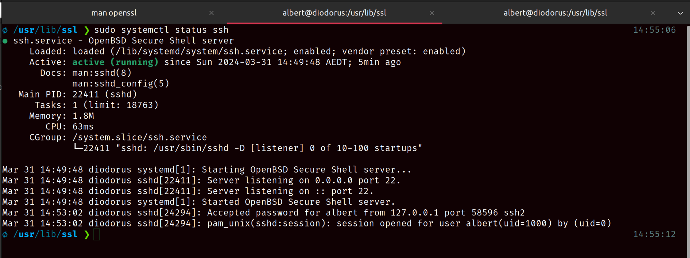
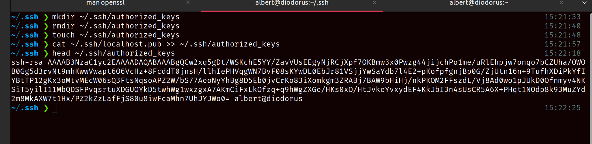
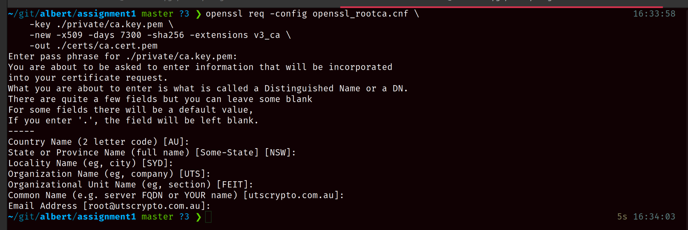

# Cryptography: Assignment 1

**Name:** Albert Ferguson **SID:** 13611165

**Group:** N/A (solo)

<div class="page"/>

## Part I: Setting up SSH

Firstly, there's a few dependencies to check. Namely, I don't have the SSH server configured
installed on my system. So I go ahead and install that and connect to localhost as a test,


You can tell I haven't connected to localhost before as the client prompts me
to add it my list of known hosts. After logging in, you can also see that
I'm running Ubuntu 22.04.4 LTS and can browse to the directory where I'm editing this
assignment.

Exiting out of this and checking the openssh server service shows it working as expected,



The daemon is running successfully without issue and shows my previous connection in the logs.
You can also spot my hostname and the date here (happy easter).

I haven't configured pubkey auth to localhost, but I have done so to other hosts already. To
add the localhost config, I'll edit my existing config file.


Then I generate a new RSA keypair with the password `ABC123`,


This is then added as an authorised key, which lets me ssh to localhost without using my account
password,




Notice I didn't provide the identity file in this command, as the config already set it.

## Part II: Creating and Configuring a Root CA

> For this part, the root CA directory will be this assignment's directory `/git/albert/assignment1`.
> The CA full config used is in the appendix for reference

To setup the CA, I start by configuring the cwd,

```sh
mkdir certs crl newcerts private
chmod 700 private
touch index.txt serial
echo 1000 > serial
```

Then I created a configuration file by copying and modfiying the demo one installed with OpenSSL,


I trimmed down some sections and configure the root cert and key directories,

```md
# root key and cert

private_key = $dir/private/ca.key.pem
certificate = $dir/certs/ca.cert.pem
```

The sample file also recommended,

```md
# recommended from docs/sample file

name_opt = ca_default
cert_opt = ca_default
```

I then configured a policy to match the assignment requirements, as we will always require these details,

```md
[ policy ]
stateOrProvinceName = match
countryName = match
organizationName = match
organizationalUnitName = match
localityName = match
commonName = supplied
emailAddress = supplied
```

Finally, I configure the defaults for requested certs. Some notable parts,

- X509 extensions are enabled,
- a challenge password is required,
- the cert

```md
[ req ]
default_bits = 2048
distinguished_name = req_distinguished_name
string_mask = utf8only
default_md = sha256
attributes = req_attributes

# Extension to add when the -x509 option is used.

x509_extensions = v3_ca

[ req_distinguished_name ]

# See <https://en.wikipedia.org/wiki/Certificate_signing_request>.

countryName = Country Name (2 letter code)
stateOrProvinceName = State or Province Name (full name) [Some-State]
localityName = Locality Name (eg, city)
0.organizationName = Organization Name (eg, company)
organizationalUnitName = Organizational Unit Name (eg, section)
commonName = Common Name (e.g. server FQDN or YOUR name)
emailAddress = Email Address

# specify defaults for this example

countryName_default = AU
stateOrProvinceName_default = NSW
localityName_default = SYD
0.organizationName_default = UTS
organizationalUnitName_default = FEIT
commonName_default = utscrypto.com.au
emailAddress_default = root@utscrypto.com.au

[ req_attributes ]
challengePassword = A challenge password
challengePassword_min = 4
challengePassword_max = 20

# an optional company name as requested in the assignment details

unstructuredName = An optional company name
```

As an extra I applied the default `[server_cert]` extension, as we're about to create a server cert for the next part.

Next, I create a 4096-bit root key with password `ABC123` and lock down its permissions as readonly,

```sh
openssl genrsa -aes256 -out ./private/ca.key.pem 4096
chmod 400 ./private/ca.key.pem
```

With that complete, then I create the root cert, ensuring to specify my custom config file. I set the expiry to
some large amount of time in the future (7300 days = 20 years). I also set its password to `ABC123`,

```sh
openssl req -config openssl_rootca.cnf \
    -key ./private/ca.key.pem \
    -new -x509 -days 7300 -sha256 -extensions v3_ca \
    -out ./certs/ca.cert.pem
```

This then prompts for the cert information, which defaults to the expected configuration,



I then lock this down to readonly for all and verify it with another openssl command,

```sh
chmod 444 certs/ca.cert.pem
openssl x509 -noout -text -in ./certs/ca.cert.pem
```


The working directory now looks like so,


## Part III: Generating an X.509 Cert for a Server

To generate an RSA private key and CSR in one go, I use the openssl command (again setting
the key to readonly)

```sh
openssl req -config openssl_rootca.cnf \
    -new -newkey rsa:2048 \
    -keyout ./albertferguson.key \
    -out ./albertferguson.csr
chmod 400 ./albertferguson.key
```

Since I have omitted the `-nodes / -noenc` flags, the default private key encryption is DES.
The command prompts a form as expected. I then verify the key,


Next, I create a certificate for the local server using the above CSR. Notably, I'm invoking
the server extensions

```sh
openssl ca -config openssl_rootca.cnf \
      -extensions server_cert -days 375 -notext -md sha256 \
      -in ./albertferguson.csr \
      -out ./albertferguson.cert
chmod 444 ./albertferguson.cert
```

Processing this and applying the chmod change,


Verifying this all,


The CA is also aware of the cert,


## Part IV: Running a secure webserver

To run the webserver, first the `.cert` and `.key` files need to be merged into the PEM format,

```sh
cat albertferguson.key >> server.pem
cat albertferguson.cert >> server.pem
chmod 400 server.pem
```

Then I append a local domain in my host file that matches the cert (`utscrypto.com.au`) using openssl to launch a server with the created PEM file,


The last part here would be to import the CA's certificate so that I can trust the site.
Importing the root CA cert for Chrome under,

> Settings > Privacy and Security > Manage Certificates > Authorities

I expected this to work. However, I am missing Subject Alternative Name (SAN) configuration,


As of 2017, Chrome 58 removed support for common names and preferred SAN [1]. This missing
config could be rectified by updating my root CA's config to include the `[ alt_names ]` extension. However, I think this is fine for the purpose of this assignment.

<div class="page"/>

## Bibliography

[1] “Deprecations and Removals in Chrome 58 | Blog,” Chrome for Developers. Accessed: Mar. 31, 2024. [Online]. Available: https://developer.chrome.com/blog/chrome-58-deprecations

## Appendix Root CA Config

```md
[ ca ]
default_ca = CA_default

[ CA_default ]
prompt            = no
dir               = /home/albert/git/albert/assignment1
certs             = $dir/certs
crl_dir           = $dir/crl
new_certs_dir     = $dir/newcerts
database          = $dir/index.txt
serial            = $dir/serial
RANDFILE          = $dir/private/.rand

# root key and cert
private_key       = $dir/private/ca.key.pem
certificate       = $dir/certs/ca.cert.pem

# for cert revocation lists
crlnumber         = $dir/crlnum
crl               = $dir/crl/mycrl.pem
default_crl_days  = 30

default_md          = sha256

# recommended from docs/sample file
name_opt = ca_default
cert_opt = ca_default

preserve          = no
# typicaly this would be used to create intermediate CAs (strict policy)
# but we're skipping a step here
policy            = policy
default_days      = 365

[ policy ]
stateOrProvinceName     = match
countryName             = match
organizationName        = match
organizationalUnitName  = match
localityName            = match
commonName              = supplied
emailAddress            = supplied

[ req ]
default_bits        = 2048
distinguished_name  = req_distinguished_name
string_mask         = utf8only
default_md          = sha256
attributes          = req_attributes

# Extension to add when the -x509 option is used.
x509_extensions     = v3_ca

[ req_distinguished_name ]
# See <https://en.wikipedia.org/wiki/Certificate_signing_request>.
countryName                     = Country Name (2 letter code)
stateOrProvinceName             = State or Province Name (full name) [Some-State]
localityName                    = Locality Name (eg, city)
0.organizationName              = Organization Name (eg, company)
organizationalUnitName          = Organizational Unit Name (eg, section)
commonName                      = Common Name (e.g. server FQDN or YOUR name)
emailAddress                    = Email Address

# specify defaults for this example
countryName_default                     = AU
stateOrProvinceName_default             = NSW
localityName_default                    = SYD
0.organizationName_default              = UTS
organizationalUnitName_default          = FEIT
commonName_default                      = utscrypto.com.au
emailAddress_default                    = root@utscrypto.com.au

[ req_attributes ]
challengePassword                       = A challenge password
challengePassword_min                   = 4
challengePassword_max                   = 20
# an optional company name as requested in the assignment details
unstructuredName                        = An optional company name

[ v3_ca ]
# Extensions for a typical CA (`man x509v3_config`).
subjectKeyIdentifier            = hash
authorityKeyIdentifier          = keyid:always,issuer
basicConstraints                = critical, CA:true
keyUsage                        = critical, digitalSignature, cRLSign, keyCertSign

[ server_cert ]
# Extensions for server certificates (`man x509v3_config`).
basicConstraints                    = CA:FALSE
nsCertType                          = server
nsComment                           = "OpenSSL Generated Server Certificate"
subjectKeyIdentifier                = hash
authorityKeyIdentifier              = keyid,issuer:always
keyUsage                            = critical, digitalSignature, keyEncipherment
extendedKeyUsage                    = serverAuth
```