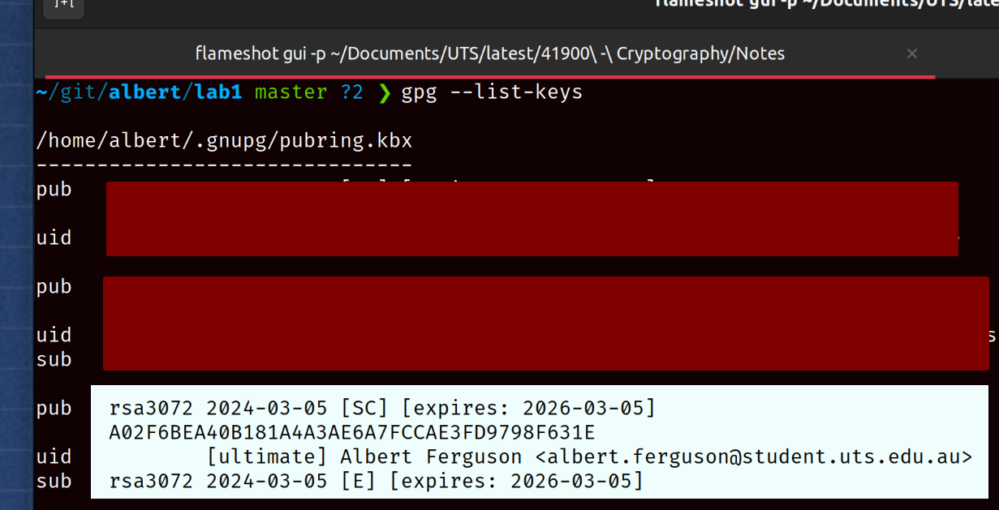
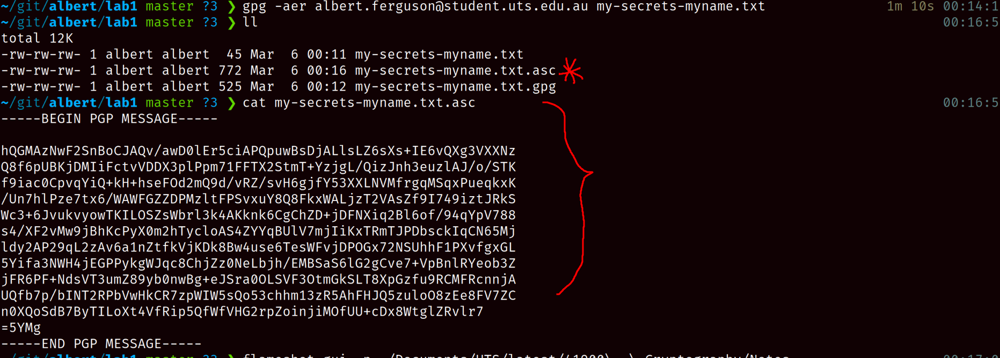
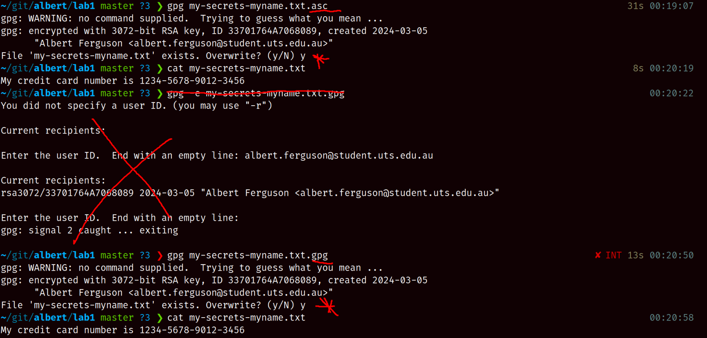
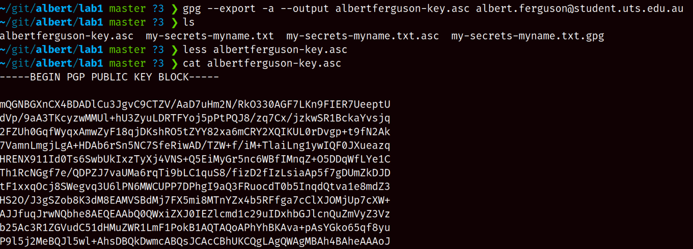
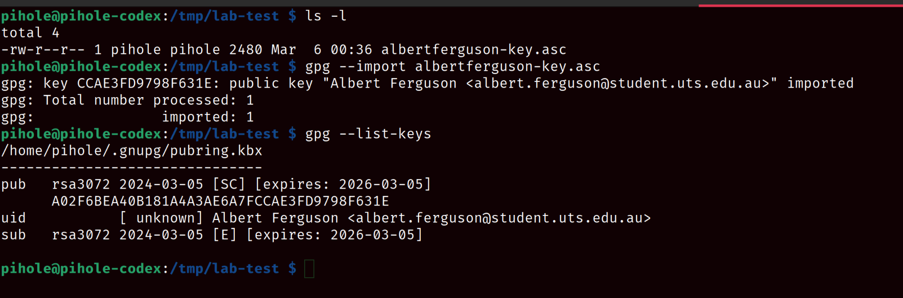
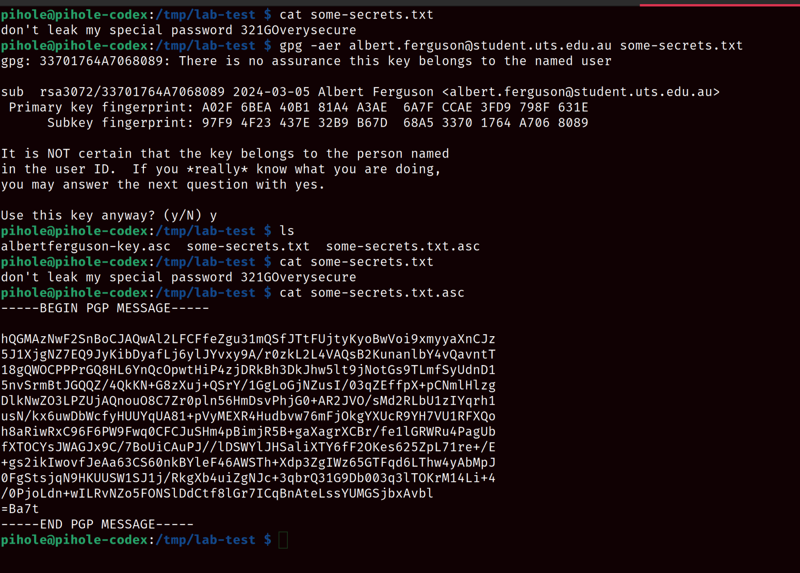
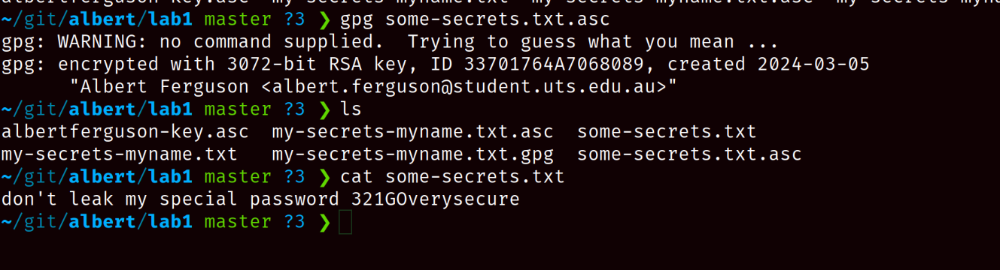

# Cryptography Lab 1

**Name:** Albert Ferguson **SID:** 13611165

## 1. Euclidian Algorithm


## 2. Extended Euclidian Algorithm


## 3. GnuPG / PGP

### Preliminaries

I'm using a debian distro and already have the dep's installed. To be certain though, I first
run the recommended installs,

```sh
sudo apt-get install gnupg rng-tools
```

Which just tells me I already them. Moving on...

### 3.1 Quick check / practice

```sh
gpg --gen-key
```

This runs a convenient interactive with the output like so,

```sh
gpg (GnuPG) 2.2.27; Copyright (C) 2021 Free Software Foundation, Inc.
This is free software: you are free to change and redistribute it.
There is NO WARRANTY, to the extent permitted by law.

Note: Use "gpg --full-generate-key" for a full featured key generation dialog.

You need a user ID to identify your key; the software constructs the user ID
from the Real Name, Comment and Email Address in this form:
    "Heinrich Heine (Der Dichter) <heinrichh@duesseldorf.de>"

Real name: Albert Ferguson
E-mail address: albert.ferguson@student.uts.edu.au
You selected this USER-ID:
    "Albert Ferguson <albert.ferguson@student.uts.edu.au>"

# excluding some filler on the entropy generation and directory creation

public and secret key created and signed.
```

I set the password to `ABC123` (nice an 'secure' so the tool warns me to change it - I do not since this is an example).

Checking the keys on my system yields the one I just created, as well as some existing keys
which I've omitted,

```sh
gpg --list-keys
```



**Questions:**

> "Why is it necessary to sign keys? Can anyone create a key and pretend to be another person? Can you think of a way to make sure that a given key really belongs to the person listed on the key? What do you think are the benefits of signing keys?"

**Answers:**

> Why is it necessary to sign keys?

Signing keys lets any third-party understand that the signer trusts the signee.

> Can anyone create a key and pretend to be another person?

No, to pretend to be another person you would have to reproduce the same key as the target.
Given the underlying key generation is random^, it is unconditionally secure and not possible to pretend to
be another person.

^ _this relies the entropy of the host which is not truly ranbom - what may be known as "high entropy"_

> Can you think of a way to make sure that a given key really belongs to the person listed on the key?

Assuming that "key" here refers to the pubkey - the private key would render this mute.
No, not directly. Funnily enough, `gpg` is kind enough to warn of this scenario when using an
imported pubkey. Typically, to "prove" ownership something akin to a "certificate authority" (as with
X.509 certs) or a "trust chain" would be needed to help prove ownership.

> What do you think are the benefits of signing keys?

Similar to the first question - simply put this allows the participating parties to build trust.
Generally speaking, signing keys creates trust because it enables, authentication, data integrity, and non-repudiation.
That last one is quite important, as users' cannot claim that they did not actually send some data.

### 3.2 Encrypt with GPG using public key


A picture tells a thousand words, ignore my umask command (recent backup had changed this).
Inputs and outputs are as expected. Final output shows both the input and output files in my current
directory.

Also encrypting with ASCII encoding, which is better for distribution, with,



### 3.3 Decrypting files



Ignore my typo in the middle, this shows decrypting both options.

## 4. Distributing and trusting keys



Above, setup to distribute the key with another host.

### 4.1 Exporting you public key with GPG

With the exported key ready to distribute. This key is in plaintext and can
potentially be intercepted. Since this is a pubkey, I am not fussed about what channel it is exposed
over. That is rather the point anyway.

### 4.2 Exchanging keys

To demo the process between to hosts, I will use a raspberry pi on my network that I have
remote using `ssh` and `scp`. Using my existing ssh configuration I remote into the host (`pihole`)
and create a temporary directory and on my host I then transfer the pubkey using `scp`.

Having set that all up, I ssh over to the pihole and import the pubkey



### 4.3 Encrypting a file for my host to read (from the pihole)

_To simplify things, I will skip setting up a second key and transferring it back to my host._
_No need to duplicate the example._

On the pihole, I use the imported pubkey to encrypt a file. It warns me of my serious transgressions,
which I choose to ignore for this demonstration. I then have the encrypted file, which I cannot decrypt.



Back on my host, I copy the encrypted file back to my machine with `scp` and decrypt it as before,



## 5. Protecting Emails with PGP

**Questions:**

> "Try the following cases and summarise your observation,"

1. Select a wrong sender’s private key. You may need to generate new private keys with different email addresses. You can remove a private key by running `gpg –delete-secret-key email@email.email `

2. The receiver has not imported the sender public key. You can remove an imported public key by running `gpg –delete-key email@email.email`

> "There are two operations in PGP, i.e., PGP sign and PGP Encrypt. What is the difference between them? You may search online."

**Answers:**

I'm pressed for time to install and configure the email client, I will attempt to answer these questions
without having done so.

> Case 1.

By selecting the wrong sender's privkey the receiver whom has already trusted the original pubkey, will
not be able to verify the signature (their key will not match).

> Case 2.

By not importing the pubkey, this is similar to case 1. This time, the receiver will not have the
trusted pubkey in-memory for validation (missing key).

> There are two operations in PGP, i.e., PGP sign and PGP Encrypt. What is the difference between them? You may search online.

This refers to the difference between sending a message to a known recipient (encrypting) and allowing
an arbitrary recipient with the pubkey to validate a known sender.

In the first scenario, the sender creates a message encrypted with the recipient's pubkey. The recipient
then decrypts it with their privkey. In the second scenario, the senders privkey signs the message and their pubkey is somehow distributed publicly. The arbitrary receipient may then verify the original message
using the (hopefully) trusted pubkey.
