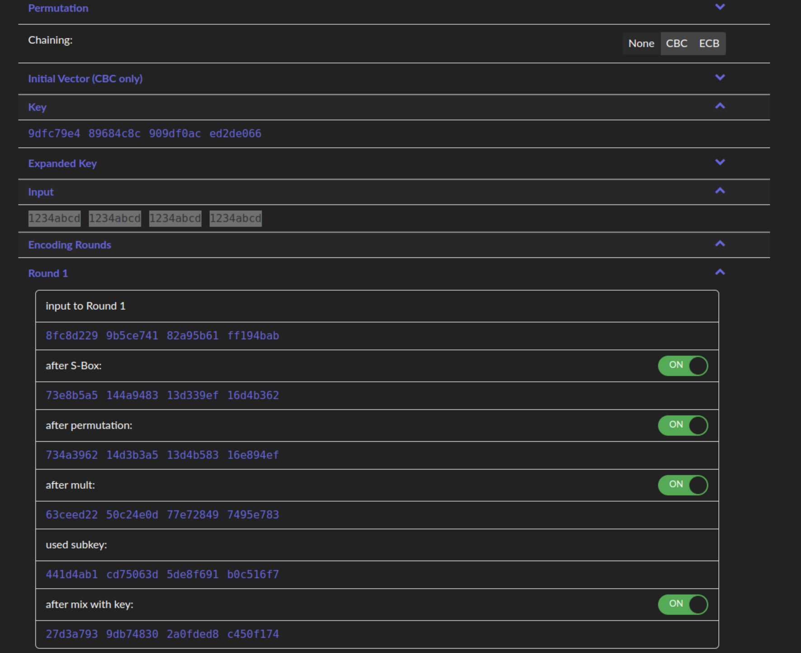
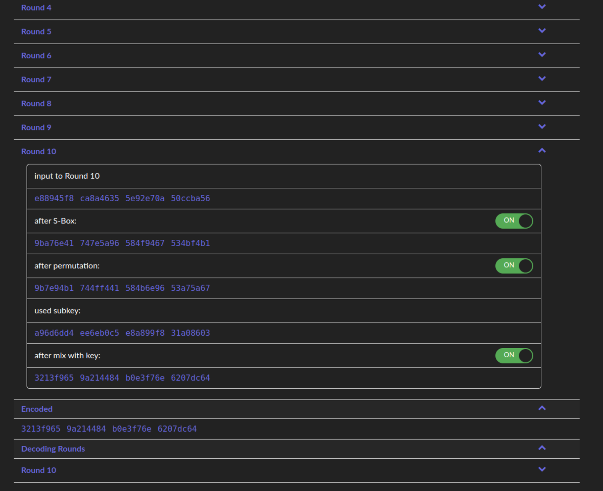
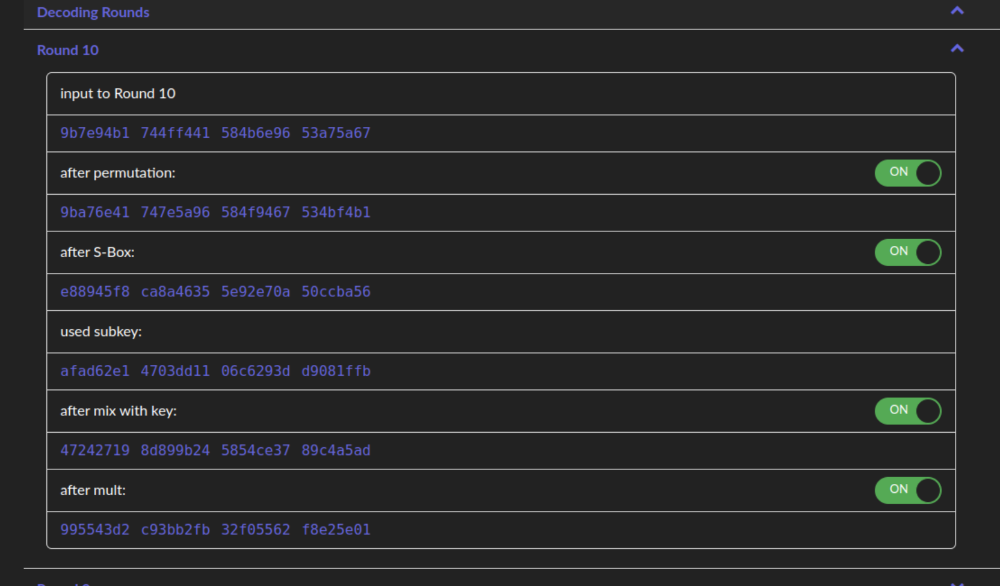
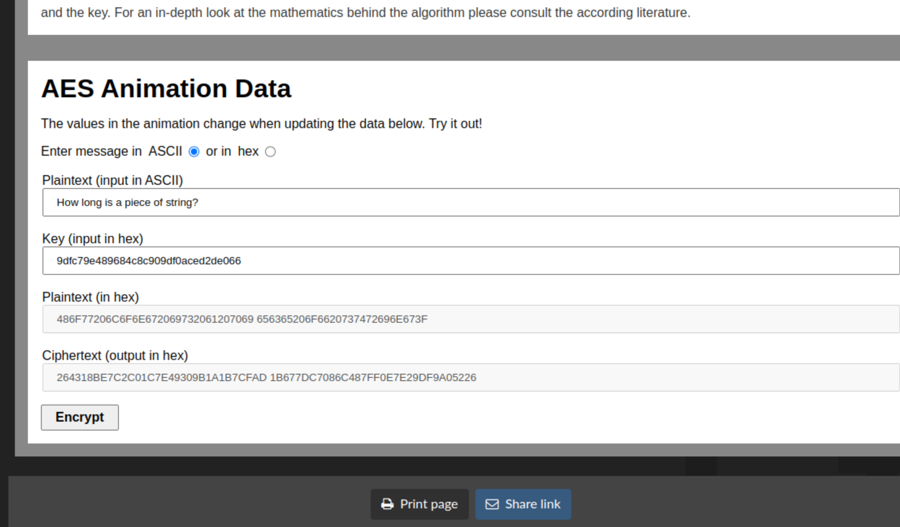
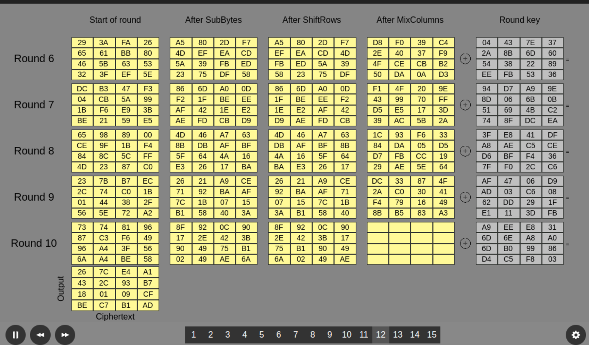
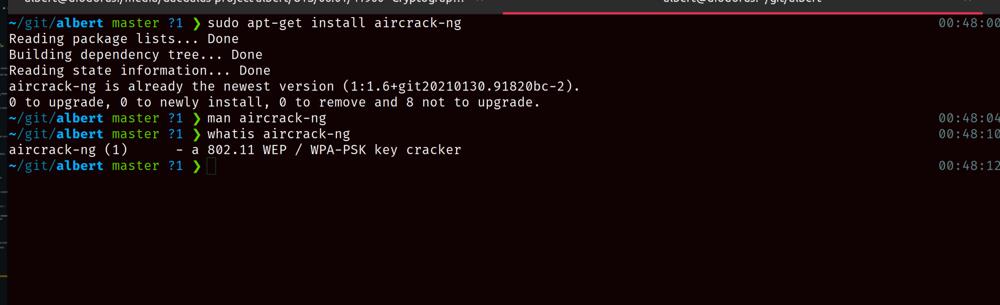
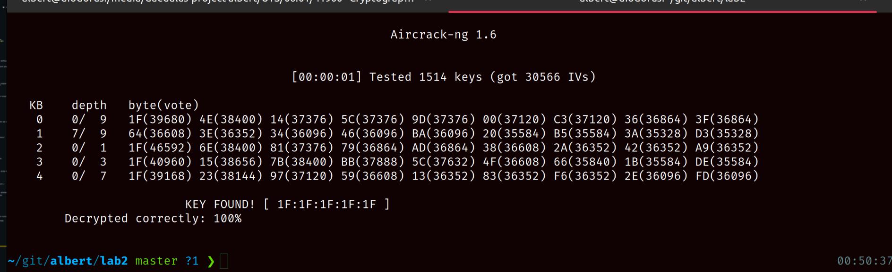
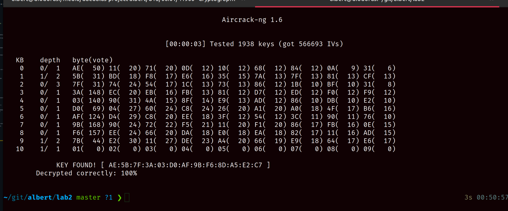
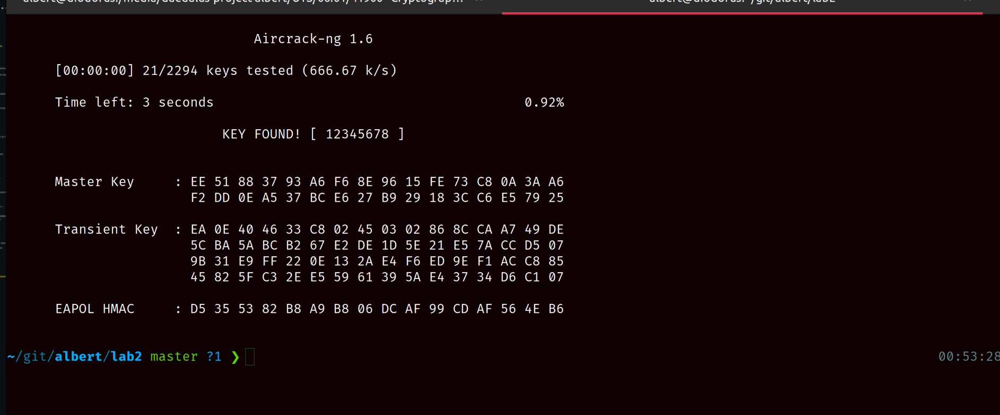

# Cryptography Lab 1

**Name:** Albert Ferguson **SID:** 13611165

## Part 1. AES

### 1.1 AES Encryption

The following uses <https://www.cryptool.org/en/cto/aes-step-by-step>.

First off, generate a 32 hex-key, `9dfc79e4 89684c8c 909df0ac ed2de066`. Then some simple
input, `1234abcd 1234abcd 1234abcd 1234abcd`. The resultant 1st round appears as,



The difference between the first and last round, `r1` and `rn`, is that the 10th round
skips the column mixing step. This is visible as the "_after mult_" step in the
below screenshot,

> The column mixing step applies a matrix multiplication to the previous permutation step. Hence, the naming.



The resultant encoded output is, `3213f9659a214484b0e3f76e6207dc64`. The decoding uses the same
atomic steps as the encode but in a different order. Where encode would take input > S-box > permutate > multiply > apply subkey. Then decode would take input > permutate > S-box > apply subkey > multiply. Likewise with encoding, the `nth` round does not execute the multiply step.



### 1.2 AES Encryption (Visualisation)

The following uses <https://www.cryptool.org/en/cto/aes-animation>.

As in #1, the same 32 hex-key is used, , `9dfc79e4 89684c8c 909df0ac ed2de066`. This time, using
a valid UTf-8 plaintext string, `"How long is a piece of string?"`. The resultant config and
ciphertext is then,



The animation pauses on the 12th slide to show the various outputs of each round-step,



Example one only allows manual hex inputs and limits the input to the length of the key. I am no
bothering with typing it out manually for comparison (tempting though). However, if I did then
I would expect each round tab to contain matching 32 hex values with the above screenshot. Where
each row from the screenshot is a segment in the round table.

## Part 2. Wi-Fi Cracking

### 2.1 Setup

Installing the dependencies is as simple as,

```sh
sudo apt-get install aircrack-ng
```



### 2.2 Cracking pre-prepared WEP network dumps

Running the following I can crack the provided dumps using PTW and Korek modes,

```sh
aircrack-ng wep_64_ptw.cap
# then later
aircrack-ng -K wep_KoreK.ivs
```





### 2.3 Cracking pre-prepared WPA2 network dumps

Using the pre-prepared WPA2 handshake capture, I ran the following to execute a dictionary
attack,

```sh
aircrack-ng -w password.lst wpa2.cap
```

The result was instant, and resolved the expected password (`12345678`),



## Part 3. WPA2/3 Questions

> Q1: What is the vulnerability of WPA2 Personal?

There are several vulnerabilities, primarly the potential for brute-force attacks.
Secondary is the "castle" defence, as a single bad-actor can snoop other clients' traffic
once the network is breached.

> Q2: How does WPA3 solve WPA2 shortcomings?

In two ways primarily,

1. PSK is dropped in favour of Simultaneous Authentication Exchange (SAE) forces realtime-handshakes and creates forward secrecy
2. personalized encryption between clients, avoids bad-actors snooping other clients' traffic.

> Q3: Is there any possible attacks against WPA3?

Yes, although either non-trivial or novel. The "Dragonblood" analysis provide details various vulnerabilities. These revolve around the SAE "dragonfly" handshake and often rely on
misimplementations of the underlying protoco. These include,

- various side-channel attacks (timing and cache based),
- DOS attacks during the SAE handshake
- and downgrade attacks during the handshake

These are revised as recently as [2020 based on this source](https://wpa3.mathyvanhoef.com/).

## Part 3. Further Questions

> Q1: How to capture the four-way handshake?

As described in the related reading. By using WireShark in monitor mode, the packets can be
passively scanned once connected to the target AP. They can be filtered from by searching
for the `EAPOL` protocol.

> Q2: What is the vulnerability of WEP used in this cracking?

WEP utilises an IV prefix to create "randomness". This is available in plaintext and easily
gathered in significant quantities (40 - 85K packets). This lab provided the packet captures
for both the PTW and FMS/Koreks methods. By XOR'ng packets with the same IV prefix, the original
packet can be recovered and then the key is easily deduced.

> Q3: What is the vulnerability of WPA2 used in this cracking?

WPA2 utilises a 4-way handshake during it's setup. This can be captured passively and attacked
offline to apply a brute-force dictionary attack. This lab provided the handshake capture and
an example (password) dictionary to demonstrate.

> Q4: What have you learnt in this lab?

I learnt about the WEP, WPA2, and WPA3 specifications in depth leading up to this lab. This
lab encouraged me to read further into the various vulnerabilities and explore the KRACKs,
Dragonblood, and PTW papers in-depth. Overall, I have learnt both that wireless security
is still a "new" domain with several exploits, and that I should immediately upgrade my
personal network's security.

## Summary

In summary, this lab had me revise my notes on AES and the various Wi-Fi standards. The initial
AES part was interesting, as it provided a visual example for the algorithm. Ironically, I
think this is the first and most concise example of the AES algorithm from all the examples in
this subject so far. Although, I personally found the original Rijndael paper far more useful.
The remainder of the lab was a quick practical on the usage of aircrack to demonstrate the
vulnerabilities of WEP and WPA2. This was an excellent intro to the tool, and thanfully skipped
the packet sniffing setup step that so many other labs would've encouraged.
