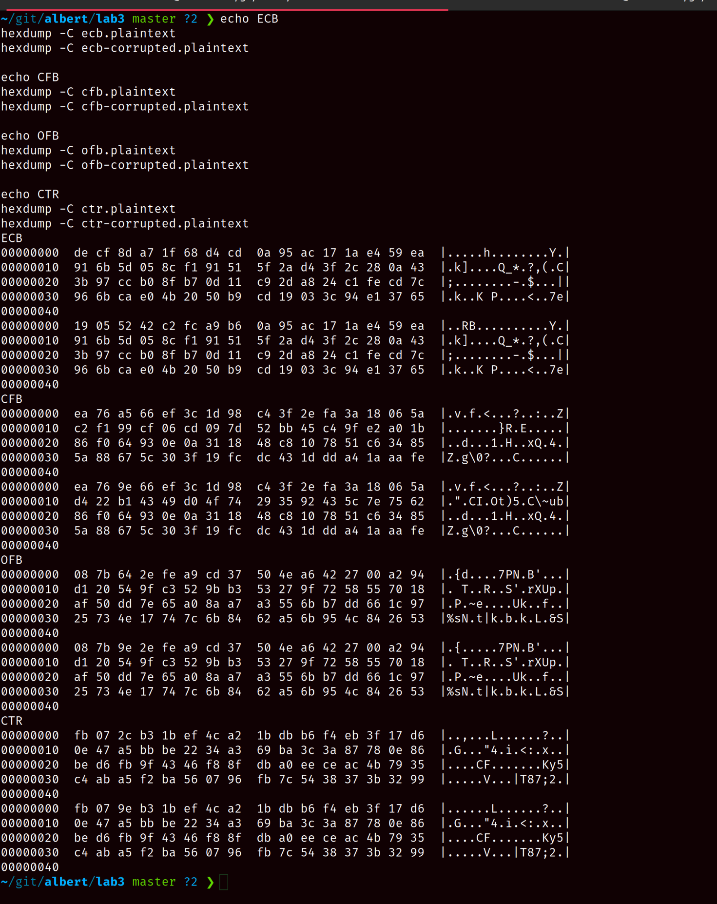

# Cryptography Lab 1

**Name:** Albert Ferguson **SID:** 13611165

## Setup

Installing dependencies, `openssl` and `bless`. I also needed to init some config for bless
and install some further dependencies, `libcanberra-gtk-module libcanberra-gtk3-module`.

```sh
sudo apt-get install openssl bless
touch ~/.config/bless/plugins
touch ~/.config/bless/export_patterns
sudo apt install libcanberra-gtk-module libcanberra-gtk3-module -y
```

Testing it all out,


<div class="page"/>

## Tasks

### 3.1 Encryption using different ciphers and modes

Before running, checkign the help and available ciphers,


```sh
key=00112233445566778889aabbccddeeff
iv=0102030405060708
openssl enc -aes-128-cbc -e -in plain.txt -out aes-cbc.bin -K $key -iv $iv
# don't provide the IV for the BF-CBC mode, as it isn't needed
openssl enc -bf-cbc -e -in plain.txt -out bf-cbc.bin -K $key
openssl enc -aes-128-cfb -e -in plain.txt -out aes-cfb.bin -K $key -iv $iv
```

This resulted in the output,


Notably I was given a warning that the "hex string was too short" for AES in both CBD and CFB
modes. This would be because the key and IV are the wrong length. OpenSSL looks to be
automatically padding these with zeroes to ensure they are the correct length before proceeding.

Also, the `bf-cbd` algorithm throws an error while setting up the cipher. I imagine this is due
to OpenSSL not supporting insecure algorithms by default. Checking the OpenSSL docs
(<https://www.openssl.org/docs/man3.0/man7/OSSL_PROVIDER-legacy.html>), this would
be because I'm using the default provider instead of the legacy provider. Swapping to this
provider resolves the issue,

```sh
openssl enc -bf-cbc -e -in plain.txt -out bf-cbc.bin -K $key -provider legacy
```


### 3.2 encryption mode ECB vs. CBC

Similar to above, I run OpenSSL with the legacy provider for ECB mode and the default for CBC
mode,

```sh
openssl enc -bf-ecb -e -in uts.bmp -out uts-ecb.bmp -K $key -provider legacy
openssl enc -aes-128-cbc -e -in uts.bmp -out uts-cbc.bmp -K $key -iv $iv
```


To view these in an image viewer, we need to reconstruct the headers. Otherwise the image
viewer will complain that the header data is bogus (which it is at the moment). To recreate
them I followed the lab prompt,

```sh
tail -c +55 uts-ecb.bmp > ecbBody
tail -c +55 uts-cbc.bmp > cbcBody
head -c 54 uts.bmp > header
cat header ecbBody > ecb-rec.bmp
cat header cbcBody > cbc-rec.bmp
```


Then in an image viewer (CBC left, ECB right),


> Q: Can you derive any useful information about the original picture from the encrypted picture? Please explain your observations.

> A: yes (in ECB mode)

ECB mode was only considered for short-length data with non-repeating bits, as repeating bits
will always result in the same ciphertext. This weakness is obvious for the sample image, as
it is 7.7MB (`du -sh uts.bmp`). Simply, although the repeated bits are encrypted they are
the same, so patterns and colors from the original image are still apparent.

However, CBC mode is superior, as the resultant ciphertext is not obviously based on the
plaintext.

### 3.3 Padding

The task requests that I check ECB, CBC, CFB, and OFB modes and assert which use padding.
Any of the above modes which use block modes will require padding to ensure the plaintext
blocks match the expected size. The stream based approaches do not require this padding.

ECB and CBC are block-wise algorithms, so will require padding. CFB will not, as it is
stream-based. Since OFC (and CTR) are similar implementations, they also don't require padding.

We can test this assumption by using the `-nopad` option in OpenSSL then checking the padding
manually,

```sh
# create a simple plaintext file
echo -n "1234567890" > f1.txt
# encrypt it with CBC (blockwise algorithm) which should apply padding
openssl enc -aes-128-cbc -in f1-enc.txt -out f1-nopad.txt -K $key -iv $iv
# decrypt without automatically removing padding
openssl enc -aes-128-cbc -d -in f1-enc.txt -out f1-nopad.txt -K $key -iv $iv -nopad
# again but as per usual
openssl enc -aes-128-cbc -d -in f1-enc.txt -out f1-nopad.txt -K $key -iv $iv
```


Then with hexdump to compare the padding we can see that the following
hex was adding as padding to the plaintext, `06 06 06 06 06 06`,


### 3.4 Error propagation - corrupted ciphertext

First we need a 64 byte input. We can achieve this using `dd`,

```sh
dd if=/dev/urandom of=./sample.plaintext bs=1 count=64
# > 64 bytes copied, 0.000254261 s, 252 kB/s
# verify with du
du -bhs ./sample.plaintext
# > 64	./sample.plaintext
```

A quick hexdump shows we have a fairly random sample,

```sh
00000000  76 53 9b cb 48 18 e1 3f  b0 7b 58 5c f2 6d 38 10  |vS..H..?.{X\.m8.|
00000010  4a a9 53 fc 72 0c 88 1f  82 9e f8 8c 5c 9f 3b 73  |J.S.r.......\.;s|
00000020  d5 c3 f0 03 01 45 bd 7a  d9 1e 4b a8 ae 1f 1a f0  |.....E.z..K.....|
00000030  42 be 5d 72 8e 2d e7 bc  42 4e 03 28 ff 96 83 70  |B.]r.-..BN.(...p|
00000040
```

We need to encrypt it as before, then create a copy before "corrupting" the copy using
bless,

```sh
openssl enc -aes-128-cbc -e -in sample.plaintext -out sample.ciphertext -K $key -iv $iv
cp sample.ciphertext ./corrupted.ciphertext
bless corrupted.ciphertext
```

Then using bless, I changed a single hex-value. The output with hexdump after saving
compares the original and corrupted,


Decrypting the corrupted file and comparing with the original

```sh
openssl enc -aes-128-cbc -d -in corrupted.ciphertext -out corrupted.plaintext -K $key -iv $iv
hexdump -C sample.plaintext
hexdump -C corrupted.plaintext
```


The highlighted block is now corrupted in plaintext. The remaining blocks are correct.

Repeating with ECB, CFB, OFB, and CTR:

```sh
dd if=/dev/urandom of=./ecb.plaintext bs=1 count=64
dd if=/dev/urandom of=./cfb.plaintext bs=1 count=64
dd if=/dev/urandom of=./ofb.plaintext bs=1 count=64
dd if=/dev/urandom of=./ctr.plaintext bs=1 count=64

openssl enc -bf-ecb -e -in ecb.plaintext -out ecb.ciphertext -K $key -provider legacy
openssl enc -aes-128-cfb -e -in cfb.plaintext -out cfb.ciphertext -K $key -iv $iv
openssl enc -aes-128-ofb -e -in ofb.plaintext -out ofb.ciphertext -K $key -iv $iv
openssl enc -aes-128-ctr -e -in ctr.plaintext -out ctr.ciphertext -K $key -iv $iv

cp ecb.ciphertext ecb-corrupted.ciphertext
cp cfb.ciphertext cfb-corrupted.ciphertext
cp ofb.ciphertext ofb-corrupted.ciphertext
cp ctr.ciphertext ctr-corrupted.ciphertext

# replacing the third character in each file
bless ecb-corrupted.ciphertext
bless cfb-corrupted.ciphertext
bless ofb-corrupted.ciphertext
bless ctr-corrupted.ciphertext

openssl enc -bf-ecb -d -in ecb.ciphertext -out ecb.plaintext -K $key -provider legacy
openssl enc -bf-ecb -d -in ecb-corrupted.ciphertext -out ecb-corrupted.plaintext -K $key -provider legacy

openssl enc -aes-128-cfb -d -in cfb.ciphertext -out cfb.plaintext -K $key -iv $iv
openssl enc -aes-128-cfb -d -in cfb-corrupted.ciphertext -out cfb-corrupted.plaintext -K $key -iv $iv

openssl enc -aes-128-ofb -d -in ofb.ciphertext -out ofb.plaintext -K $key -iv $iv
openssl enc -aes-128-ofb -d -in ofb-corrupted.ciphertext -out ofb-corrupted.plaintext -K $key -iv $iv

openssl enc -aes-128-ctr -d -in ctr.ciphertext -out ctr.plaintext -K $key -iv $iv
openssl enc -aes-128-ctr -d -in ctr-corrupted.ciphertext -out ctr-corrupted.plaintext -K $key -iv $iv

# compare hexdumps
echo ECB
hexdump -C ecb.plaintext
hexdump -C ecb-corrupted.plaintext

echo CFB
hexdump -C cfb.plaintext
hexdump -C cfb-corrupted.plaintext

echo OFB
hexdump -C ofb.plaintext
hexdump -C ofb-corrupted.plaintext

echo CTR
hexdump -C ctr.plaintext
hexdump -C ctr-corrupted.plaintext
```



From the above results,

- ECB: can recover all plaintext except for the corrupted block
- CFB: self-heals and recovers all plaintext except the corrupted character and the next block (third row from CFB result screenshot).
- OFB and CTR: recover the best, as only the affected character is corrupted and all other plaintext is recovered.

### 3.5 Initial Vector (IV)

Setting up some variables and then running the encryption twice for two different keys,

```sh
key=00112233445566778889aabbccddeeff
iv1=0102030405060708
iv2=0102030405060123
openssl enc -aes-128-cbc -in f1.txt -out a.ciphertext -K $key -iv $iv1
openssl enc -aes-128-cbc -in f1.txt -out b.ciphertext -K $key -iv $iv2
hexdump -C a.ciphertext
hexdump -C b.ciphertext
```


> Q: What properties the IV should have? Why?

> A: In all cases, the IV should always be unique. The IV should also be unpredictable by 3rd
> parties and secret (until encryption has completed).

Regarding secrecy, the IV will be made public (typically as a prefix) once the ciphertext is transmitted.

An IV should be both unpredictable (to a 3rd party) as well as unique. If it is predictable,
the cryptanalysis techniques can potentially provide knowledge of the plaintext. This is an
issue when the IV is the same as the plaintext, as the resultant ciphertext will XOR to `0`.

If the IV is randomly unique but predictable, then there is potential for a chosen-plaintext
attack. Whereby a 3rd party provides the encoder the original IV as well the predicted IV.
By passing the predicted IV before encryption, the algorithm will cancel out the predicted IV
and leave re-use the original IV. The encoder would then regenerate the original ciphertext.

<div class="page"/>

## Summary and discussion

This lab provided examples and problems regarding various cipher modes. by progressively
exploring the encoding process, padding, and error propagation I've come to understand
the iterative improvements and reasoning behind each mode.

This week's content builds on previous weeks, which have previously discussed IVs and mentioned
CBC in relation to various WiFi spec's. Expanding on this content in detail after understanding
an implementation gives me an excellent 'hook' to remember the content more effectively.

Further, having now broken down the vulnerabilities in CBC in detail, previous content regarding
vulnerabilities in WEP and WPA make more sense to me, as I am now familiar with the "why" as
well as the "what".
